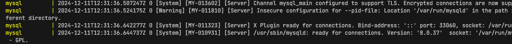
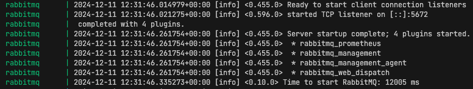
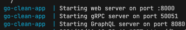

# Cleanarch

## Como rodar o projeto

Instale a lib do evans para comunicar-se com o servidor GRPC:
- https://github.com/ktr0731/evans?tab=readme-ov-file#installation

Rode o comando do Dokcer para subir os todos os containers: `docker-compose up --build -d`.





<br>

Testando o *Web Server*:
- Use o arquivo `order.http` dentro do diretório `api`.

Testando o *GRPC Server*:

```shell
evans --proto internal/infra/grpc/protofiles/order.proto --host local
host --port 50051

pb.OrderService@localhost:50051> call CreateOrder
id (TYPE_STRING) => s20dmc
price (TYPE_FLOAT) => 20
tax (TYPE_FLOAT) => 3
{
  "finalPrice": 23,
  "id": "s20dmc",
  "price": 20,
  "tax": 3
}

pb.OrderService@localhost:50051> call ListOrders
{
  "orders": [
    {
      "finalPrice": 23,
      "id": "s20dmc",
      "price": 20,
      "tax": 3
    }
  ]
}
```

Testando o *GraphQL Server*:

> http://localhost:8080/

```graphql
mutation createOrder {
  createOrder(
    input: { id: "wkjsoi2", price: 20, tax: 2 }
  ) {
    id
  }
}

query queryOrders {
  list {
    id
    price
    tax
    finalPrice
  }
}
```
